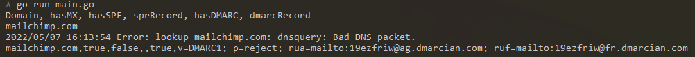

# Email Checker Tool with Golang

Checking MX,SPF,DMARC Mail with built-in library go
By checking these we will know if the domain is at least right

### MX
A DNS 'mail exchange' (MX) record directs email to a mail server. The MX record indicates how email messages should be routed in accordance with the Simple Mail Transfer Protocol (SMTP, the standard protocol for all email).

### SPF
The Sender Policy Framework (SPF) is an email-authentication technique which is used to prevent spammers from sending messages on behalf of your domain.

### DMARC
Domain-based Message Authentication Reporting and Conformance (DMARC) is a free and open technical specification that is used to authenticate an email by aligning SPF and DKIM mechanisms. By having DMARC in place, domain owners large and small can fight business email compromise, phishing and spoofing

 <br>

```
ex : mailchimp.com
-domain = mailchimp.com
-hasMX = true
-hasSPF = false
-spfRecord = - (bcs its false)
-hasDMARC = true
-dmarcRecord = v=DMARC1; p=reject; rua=mailto:19ezfriw@ag.dmarcian.com; ruf=mailto:19ezfriw@fr.dmarcian.com
```
